# Database Entity Relationship Diagram (ERD)

## Overview

This document provides a comprehensive Entity Relationship Diagram for the SaaS application database schema. The database is built on PostgreSQL with Supabase and includes user management, team collaboration, billing, and audit logging.

## Database Schema

```mermaid
erDiagram
    USERS {
        bigint id PK "Primary key, auto-generated"
        text name "User display name"
        text email UK "Email address, unique"
        text password_hash "Hashed password"
        text role "User role: owner, admin, member"
        timestamptz created_at "Account creation timestamp"
        timestamptz updated_at "Last update timestamp"
        timestamptz deleted_at "Soft delete timestamp"
    }

    TEAMS {
        bigint id PK "Primary key, auto-generated"
        text name "Team name"
        timestamptz created_at "Team creation timestamp"
        timestamptz updated_at "Last update timestamp"
    }

    TEAM_MEMBERS {
        bigint id PK "Primary key, auto-generated"
        bigint user_id FK "Reference to users.id"
        bigint team_id FK "Reference to teams.id"
        text role "Member role: owner, admin, member"
        timestamptz joined_at "When user joined team"
    }

    ACTIVITY_LOGS {
        bigint id PK "Primary key, auto-generated"
        bigint team_id FK "Reference to teams.id"
        bigint user_id FK "Reference to users.id (nullable)"
        text action "Action performed"
        timestamptz occurred_at "When action occurred"
        text ip_address "IP address of user"
    }

    INVITATIONS {
        bigint id PK "Primary key, auto-generated"
        bigint team_id FK "Reference to teams.id"
        text email "Invited email address"
        text role "Invited role: owner, admin, member"
        bigint invited_by FK "Reference to users.id"
        timestamptz invited_at "When invitation was sent"
        text status "Invitation status: pending, accepted, revoked"
    }

    BILLING_CUSTOMERS {
        bigint id PK "Primary key, auto-generated"
        bigint team_id FK "Reference to teams.id"
        text stripe_customer_id UK "Stripe customer ID, unique"
        text email "Customer email"
        timestamptz created_at "Customer creation timestamp"
        timestamptz updated_at "Last update timestamp"
    }

    SUBSCRIPTIONS {
        bigint id PK "Primary key, auto-generated"
        bigint team_id FK "Reference to teams.id"
        text stripe_subscription_id UK "Stripe subscription ID, unique"
        text status "Subscription status"
        text stripe_product_id "Stripe product ID"
        text stripe_price_id "Stripe price ID"
        text plan_name "Human-readable plan name"
        timestamptz current_period_end "Current billing period end"
        timestamptz created_at "Subscription creation timestamp"
        timestamptz updated_at "Last update timestamp"
    }

    TEAM_MEMBERSHIPS_MV {
        bigint team_id PK "Team ID"
        bigint user_id PK "User ID"
        text role "Member role"
        text team_name "Team name (denormalized)"
    }

    TEAM_BILLING_MV {
        bigint team_id PK "Team ID"
        text stripe_customer_id "Stripe customer ID"
        text stripe_subscription_id "Stripe subscription ID"
        text subscription_status "Current subscription status"
        text plan_name "Current plan name"
        text stripe_product_id "Stripe product ID"
        text stripe_price_id "Stripe price ID"
    }

    %% Relationships
    USERS ||--o{ TEAM_MEMBERS : "belongs to"
    TEAMS ||--o{ TEAM_MEMBERS : "contains"
    TEAMS ||--o{ ACTIVITY_LOGS : "logs"
    USERS ||--o{ ACTIVITY_LOGS : "performs"
    TEAMS ||--o{ INVITATIONS : "sends"
    USERS ||--o{ INVITATIONS : "invites"
    TEAMS ||--o{ BILLING_CUSTOMERS : "has"
    TEAMS ||--o{ SUBSCRIPTIONS : "subscribes"
    TEAMS ||--o{ TEAM_MEMBERSHIPS_MV : "materialized"
    TEAMS ||--o{ TEAM_BILLING_MV : "materialized"
```

## Table Descriptions

### Core Tables

#### USERS
- **Purpose**: Stores user account information
- **Key Features**: 
  - Soft delete support (`deleted_at`)
  - Role-based access control
  - Email uniqueness constraint
- **Indexes**: `email`, `deleted_at`

#### TEAMS
- **Purpose**: Represents organizations/teams in the system
- **Key Features**: 
  - Simple team structure
  - Audit trail with `created_at`/`updated_at`

#### TEAM_MEMBERS
- **Purpose**: Many-to-many relationship between users and teams
- **Key Features**: 
  - Role-based membership (`owner`, `admin`, `member`)
  - Unique constraint on `(team_id, user_id)`
  - Cascade delete on team/user removal

### Activity & Audit

#### ACTIVITY_LOGS
- **Purpose**: Audit trail for all team activities
- **Key Features**: 
  - Links to both team and user (user can be null for system actions)
  - IP address tracking
  - Chronological ordering

#### INVITATIONS
- **Purpose**: Manages team invitation workflow
- **Key Features**: 
  - Status tracking (`pending`, `accepted`, `revoked`)
  - Role assignment at invitation time
  - Email-based invitations

### Billing & Subscriptions

#### BILLING_CUSTOMERS
- **Purpose**: Stripe customer information per team
- **Key Features**: 
  - One-to-one with teams
  - Stripe customer ID mapping
  - Email for billing communications

#### SUBSCRIPTIONS
- **Purpose**: Active Stripe subscriptions per team
- **Key Features**: 
  - Subscription status tracking
  - Plan and pricing information
  - Billing period management

### Materialized Views

#### TEAM_MEMBERSHIPS_MV
- **Purpose**: Denormalized view of team memberships for performance
- **Key Features**: 
  - Includes team name for easy querying
  - Refreshed via `refresh_team_views()` function

#### TEAM_BILLING_MV
- **Purpose**: Denormalized view of team billing information
- **Key Features**: 
  - Latest subscription information per team
  - Optimized for billing queries

## Security Features

### Row Level Security (RLS)
All tables have RLS enabled with policies that enforce:

- **Users**: Can only access their own records
- **Teams**: Members can read, owners/admins can modify
- **Team Members**: Read access for members, full access for owners/admins
- **Activity Logs**: Read access for team members or own activities
- **Invitations**: Read access for team members, manage for owners/admins
- **Billing**: Read access for owners/admins only

### Helper Functions

#### `current_app_user_id()`
Returns the current authenticated user ID from JWT claims.

#### `current_app_user_role(team_id)`
Returns the current user's role within a specific team.

#### `refresh_team_views()`
Refreshes materialized views for optimal performance.

## Indexes

### Performance Indexes
- `users_email_idx`: Fast email lookups
- `users_deleted_at_idx`: Soft delete queries
- `team_members_user_id_idx`: User membership queries
- `team_members_team_id_idx`: Team member queries with role filtering
- `activity_logs_team_id_idx`: Team activity queries (chronological)
- `activity_logs_user_id_idx`: User activity queries (chronological)
- `invitations_email_idx`: Email-based invitation lookups
- `invitations_team_idx`: Team invitation queries
- `billing_customers_team_id_idx`: Team billing lookups
- `subscriptions_team_id_idx`: Team subscription queries
- `subscriptions_status_idx`: Subscription status filtering

### Materialized View Indexes
- `team_memberships_mv_team_user_idx`: Unique constraint on team-user pairs
- `team_billing_mv_team_id_idx`: Unique constraint on team ID

## Data Flow

1. **User Registration**: User creates account → `USERS` table
2. **Team Creation**: User creates team → `TEAMS` table + `TEAM_MEMBERS` entry
3. **Team Invitations**: Owner/admin invites users → `INVITATIONS` table
4. **Activity Tracking**: All actions logged → `ACTIVITY_LOGS` table
5. **Billing Setup**: Team subscribes → `BILLING_CUSTOMERS` + `SUBSCRIPTIONS` tables
6. **Performance**: Materialized views refreshed periodically for optimal query performance

## Constraints

### Check Constraints
- User roles: `('owner','admin','member')`
- Team member roles: `('owner','admin','member')`
- Invitation roles: `('owner','admin','member')`
- Invitation status: `('pending','accepted','revoked')`

### Unique Constraints
- User email addresses
- Stripe customer IDs
- Stripe subscription IDs
- Team-member pairs (one membership per user per team)

### Foreign Key Constraints
- All foreign keys have appropriate cascade/set null behaviors
- Referential integrity maintained across all relationships

## Maintenance

### Triggers
- `set_updated_at`: Automatically updates `updated_at` timestamp on record modifications

### Functions
- `refresh_team_views()`: Call periodically to refresh materialized views
- `current_app_user_id()`: JWT-based user identification
- `current_app_user_role()`: Role-based access control

This schema provides a robust foundation for a multi-tenant SaaS application with comprehensive security, audit trails, and billing integration.
